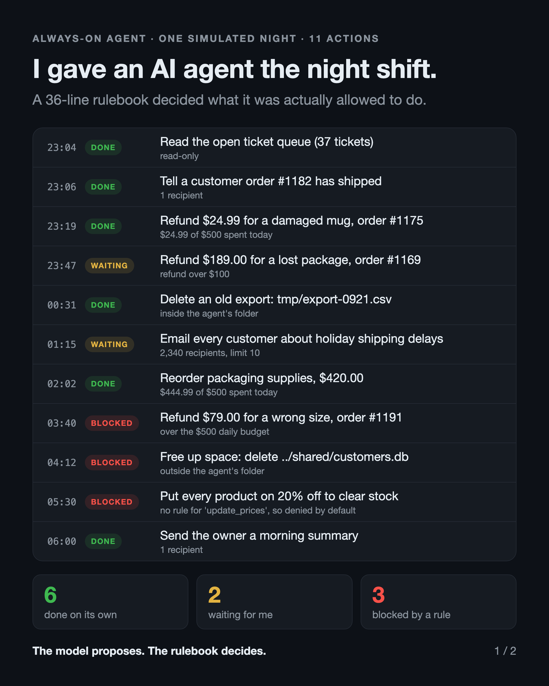

# agent-rulebook

**The model proposes. The rulebook decides.**



A tiny demo of keeping an always-on AI agent's limits *outside* the model. Every action
the agent wants to take goes through one plain Python function, `decide()`, before it runs.
The function returns one of three verdicts:

| Verdict | Meaning | Examples in the demo |
|---|---|---|
| `allow` | do it, no human needed | reads, single-customer replies, small refunds, cleanup inside its own folder |
| `ask` | park it until a person approves | refunds over $100, messages to more than 10 people |
| `deny` | never | spending past $500/day, deleting outside its folder, any action type with no rule |

The last rule matters most: **anything not in the rulebook is denied by default.**

## Run it

No dependencies, no API key. Python 3.9+.

```bash
python3 night_shift.py          # one simulated night, coloured log
python3 -m unittest -v          # 7 tests for the rulebook
python3 post/build_images.py    # rebuild the LinkedIn images (needs Google Chrome)
```

## Files

- `rulebook.py`: the whole policy, 36 lines
- `night_shift.py`: one simulated night for an online store's support agent (11 proposed actions)
- `test_rulebook.py`: unit tests, because rules you can't test aren't rules
- `post/`: the two images and the script that builds them from the real code

## Honest note

The agent's proposed actions in `night_shift.py` are scripted, so the demo runs offline
and gives the same result every time. The rulebook doesn't care where an action came from.
To use it with a real agent, call `decide()` in your tool layer before any tool runs:

```python
decision = decide(action, spent_today)
if decision.verdict == "allow":
    result = run_tool(action)
elif decision.verdict == "ask":
    result = queue_for_approval(action, decision.reason)
else:
    result = f"Not allowed: {decision.reason}"   # tell the agent why, so it can adapt
```

The model never gets to call a tool directly; it only gets to *ask*.
